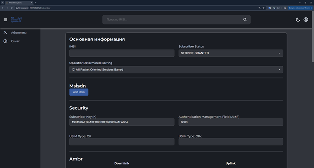
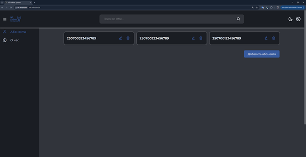
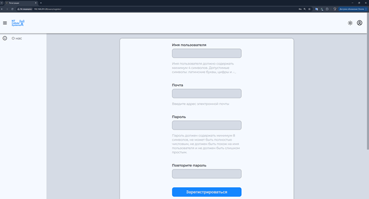
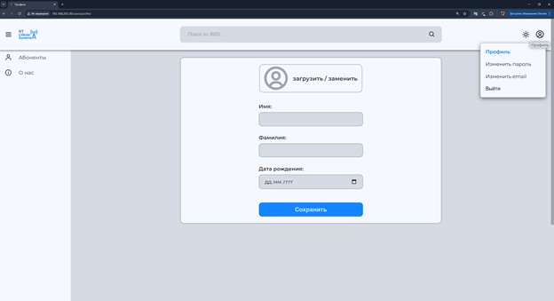

<h1 align="center">TS CORE</h1>

**TS CORE** — сайт для управления 5G/4G-подписчиками, построенный на Django. Он ориентирован на сетевых администраторов или инженеров телеком-операторов, которые настраивают параметры абонентов в мобильной сети.

---

## 🔍 Описание проекта

TS CORE — это интерфейс управления параметрами мобильных абонентов (Subscriber Management).  
Система позволяет удобно редактировать, валидировать и сохранять вложенные структуры, включая:

- **MSISDN** — один или несколько мобильных номеров
- **Безопасность** — криптографические параметры (K, AMF, OP/OPc)
- **AMBR (Aggregate Maximum Bit Rate)** — лимиты скорости передачи данных
- **Сетевые срезы (Slices)** — конфигурации S-NSSAI, SST, SD, QoS, PCC
- **Сессии доступа (Session Configs)** — параметры интернет-подключения и QoS

Редактирование осуществляется через JSON-формы с помощью [django-jsonform](https://pypi.org/project/django-jsonform/).

<p align="center">
  
  
</p>

---

## 👤 Что может делать пользователь

- Создавать/редактировать подписчиков сети (MSISDN, безопасность, срезы и пр.)
- Настраивать параметры аутентификации
- Определять лимиты скорости (AMBR)
- Задавать параметры Slice/S-NSSAI
- Валидировать данные перед сохранением (hex, диапазоны и пр.)

Дополнительно для авторизованных пользователей:

- Изменение пароля и email (с подтверждением)
- Редактирование профиля
- Восстановление пароля по email-ссылке
- Регистрация с подтверждением email

Администратор определяет права доступа и управляет системой через Django Admin.

<p align="center">
  
  
</p>

---

## 🧩 Стек технологий:
| Категория          | Технологии                          |
|--------------------|-------------------------------------|
| **Backend**        | Python 3.9, Django                  |
| **Frontend**       | Jinja2, django-jsonform             |
| **База данных**    | PostgreSQL, MongoDB                 |
| **Инфраструктура** | Docker, Docker Compose, Nginx       |
| **CI/CD**          | GitHub Actions                      |

<div align="center">

<table>
  <thead>
    <tr>
      <th>Категория</th>
      <th>Технологии</th>
    </tr>
  </thead>
  <tbody>
    <tr>
      <td><strong>Backend</strong></td>
      <td>Python 3.9, Django</td>
    </tr>
    <tr>
      <td><strong>Frontend</strong></td>
      <td>Jinja2, django-jsonform</td>
    </tr>
    <tr>
      <td><strong>База данных</strong></td>
      <td>PostgreSQL, MongoDB</td>
    </tr>
    <tr>
      <td><strong>Инфраструктура</strong></td>
      <td>Docker, Docker Compose, Nginx</td>
    </tr>
    <tr>
      <td><strong>CI/CD</strong></td>
      <td>GitHub Actions</td>
    </tr>
  </tbody>
</table>

</div>

---

## 🚀 Установка и запуск проекта в Docker

### Подготовка окружения
1. Создайте папку проекта и перейдите в неё:
```
mkdir ts_core && cd ts_core
```
2. Создайте файл `.env` со следующими переменными окружения:
```
# Django (в production никогда не используйте DEBUG=True)
SECRET_KEY=<сложный_ключ>
DEBUG=False
DJANGO_ALLOWED_HOSTS=<хост_сервера>,localhost,127.0.0.1

# Email
EMAIL_HOST=<SMTP_хост>
EMAIL_PORT=<SMTP_порт>
EMAIL_HOST_USER=<почтовый_логин>
EMAIL_HOST_PASSWORD=<почтовый_пароль>
EMAIL_USE_TLS=True

# Админ по умолчанию
ADMIN_USERNAME=<имя_админа>
ADMIN_EMAIL=<email_админа>
ADMIN_PASSWORD=<пароль_админа>

# PostgreSQL (закомментируйте DB_HOST и DB_PORT для разработки)
POSTGRES_USER=<db_user>
POSTGRES_PASSWORD=<db_password>
POSTGRES_DB=<db_name>
DB_HOST=ts_core_db
DB_PORT=5432

# MongoDB (закомментируйте MONGO_HOST и MONGO_PORT для разработки)
MONGO_HOST=host.docker.internal
MONGO_PORT=27018
```

### Установка Docker и Docker Compose (Ubuntu)
1. Обновите пакеты и установите зависимости:
```
sudo apt update && sudo apt install ca-certificates curl
```
2. Добавьте GPG-ключ и репозиторий Docker:
```
sudo install -m 0755 -d /etc/apt/keyrings
```
```
curl -fsSL https://download.docker.com/linux/ubuntu/gpg | \
  sudo tee /etc/apt/keyrings/docker.asc > /dev/null
sudo chmod a+r /etc/apt/keyrings/docker.asc
```
```
echo \
  "deb [arch=$(dpkg --print-architecture) signed-by=/etc/apt/keyrings/docker.asc] \
  https://download.docker.com/linux/ubuntu \
  $(. /etc/os-release && echo "${UBUNTU_CODENAME:-$VERSION_CODENAME}") stable" | \
  sudo tee /etc/apt/sources.list.d/docker.list > /dev/null
```
3. Установите Docker:
```
sudo apt-get install docker-ce docker-ce-cli containerd.io docker-buildx-plugin docker-compose-plugin
```
4. Проверьте работу Docker:
```
sudo systemctl status docker 
```

### Перенос Docker-хранилища (опционально)
1. Остановите Docker:
```
sudo systemctl stop docker
```
2. Переместите хранилище:
```
sudo mv /var/lib/docker <новый_путь>;
sudo ln -s <новый_путь> /var/lib/docker;
sudo chown -R root:root <новый_путь>;
```
3. Перезапустите Docker и проверьте:
```
sudo systemctl start docker && docker info | grep "Docker Root Dir"
```

### Запуск приложения в Docker
1. Скопируйте в папку `ts_core`:
   - файл docker-compose.production.yml
   - папку system_config
2. Загрузите/обновите образы из Docker Hub:
```
sudo docker compose -f docker-compose.production.yml pull
```
4. Перезапустите сервисы:
```
sudo docker compose -f docker-compose.production.yml down
```
```
sudo docker compose -f docker-compose.production.yml up -d
```
6. Выполните настройки из `system_config`:
```
cd system_config;
chmod +x setup_socat_proxy.sh;
chmod +x shutdown_counter.sh;
chmod +x update_crontab.sh;
./setup_socat_proxy.sh;
./shutdown_counter.sh;
./update_crontab.sh;
```

### Настройка Nginx
1. Отредактируйте файл `/etc/nginx/sites-enabled/default`:
```
server {
        listen 80;

        server_name _;

        location / {
            proxy_set_header Host $http_host;
            proxy_pass http://127.0.0.1:8000;
        }
}
```
2. Проверьте и примените конфигурацию:
```
sudo nginx -t
```
```
sudo service nginx reload
```

### ✅ Готово!
Приложение будет доступно по адресу: `http://<хост_сервера>/`

---

## ⚙️ Установка и запуск проекта в режиме разработки
### Предварительные требования
- Установленные Docker и Docker Compose
- Git
- Python 3.9

### Запуск приложения
1. Склонируйте репозиторий и перейдите в папку проекта:
```
git clone https://github.com/AlexanderCholiy/ts_core.git;
cd ts_core
```
2. В `.env` файле закомментируйте `DB_HOST`, `DB_PORT`, `MONGO_HOST`, `MONGO_PORT`.
3. Установите и активируйте виртуальное окружение и зависимости
```
python3.9 -m venv venv
```
> Установка виртуального окружения (версия python 3.9).
```
. .\venv\Scripts\activate
```
> Активация виртуального окружения для Windows.
```
. ./venv/bin/activate
```
> Активация виртуального окружения для Linux или MacOS.
```
pip install -r requirements.txt
```
> Установка зависимостей.
4. Запуск докер контейнера с базой данных:
```
sudo docker volume create ts_core_db_data
```
> Создает Docker volume для хранения данных PostgreSQL вне контейнера
```
sudo docker run --name ts_core_db --env-file .env -v ts_core_db_data:/var/lib/postgresql/data -p 5438:5432 postgres:13.10
```
> Порт 5438 хоста перенаправляется на 5432 контейнера. Это позволяет избежать конфликта с другими PostgreSQL-инстансами на машине.
5. В новом терминале с активированном виртульном окружениии создайте и примените миграции:
```
python manage.py makemigrations
```
```
python manage.py migrate
```
6. Создайте суперпользователя:
```
python manage.py createsuperuser
```
7. Запуск приложения:
```
python manage.py runserver
```

---

## 🛠️ Полезные команды
Команды для управления контейнерами, проверки стиля кода и установки зависимостей:
### Docker
```
sudo docker compose stop
```
> Остановка всех контейнеров, указанных в docker-compose.yml
```
sudo docker container prune -f
```
> Удалить все остановленные контейнеры
```
sudo docker image prune -f
```
> Удалить все неиспользуемые образы

### Проверка стиля кода
```
python -m flake8
```
> Проверка соответствия PEP8
```
isort .
```
> Автоматическая сортировка импортов

### Установка зависимостей
```
pip install <имя_библиотеки> --no-deps
```
> Используйте флаг --no-deps, чтобы избежать автоматической установки зависимостей, которые могут конфликтовать с текущими версиями библиотек, особенно с Django.
> Это особенно важно, так как для работы с MongoDB используется djongo, который требует строго определённую версию Django (например, Django 3.2), и автоматическая установка может её перезаписать.

---

## Автор
**Чолий Александр** ([Telegram](https://t.me/alexander_choliy))
